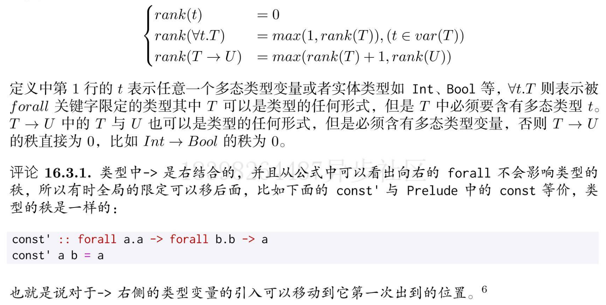

## 值，类型，类型类，Kind

类型：

- 实体类型： `Bool`
- 多态类型：`length :: [a] -> Int`
- 类型类限定类型：`sum :: Num a => [a] -> a`，类型类就是对类型进行分类，使得一些函数对部分类型有效。

Kind：类型的类型就是 Kind，一个类型构造器可能有零个或者多个类型参数，这个类型构造器与数据构造器一样拥有类型，为 Kind

- 实体 Kind：就是不需要类型参数的类型（`Bool，String，Maybe Int`）

- 数据 Kind：以定义的值为类型，以定义类型为 Kind（需要 `DataKinds` 扩展），此时 Kind 不为 `*`，而是具体的数据 Kind Type（对应的类型）

  ```haskell
  {-# LANGUAGE GADTs, KindSignatures, DataKinds #-}
  
  data KEmpty = Empty | NoEmpty
  
  -- data List a b where 的第二个参数没有进行限制可以为任意类型
  data SafeList :: * -> KEmpty -> * where
    Nil :: SafeList a Empty
    Cons :: a -> SafeList a b -> SafeList a NoEmpty
  
  safeHead :: SafeList a NoEmpty -> a
  safeHead (Cons x _) = x
  ```

- 多态Kind：与多态类型相似

## 类型推断

## 高秩类型

### 函数的元与阶


计算阶的公式：


例子：

`map :: (a -> b) -> [a] -> [b]` 2元2阶函数

`foldl :: (b -> a -> b) -> b -> [a] -> b` 3元2阶函数

### 类型的秩

假设需要设计一个函数：

```haskell
applyTuple f (xs, ys) = (f xs, f ys) -- xs, ys 的多态类型不同 xs :: [a] , ys :: [b]
```

现有方法中 `f` 函数的类型是无法定义出来的，若是借助 `RankType Rank2Type RankNType` 等扩展则可以定义出 `f` 的类型

```haskell
{-# LANGUAGE Rank2Types #-}
applyTuple :: (forall a . [a] -> [a]) -> ([b], [c]) -> ([b], [c])
applyTuple f (xs, ys) = (f xs, f ys)
```

关于 `f` 的类型，我们使用关键词 `forall` （明确全称量词）对 `f` 的多态进行声明，也就是满足所有多态类型 `a`，`RankType` 等扩展的名字也是有意义的，`RankType` 所支持类型的阶数为1（默认无须声明），`Rank2Type`s 支持类型的阶数为 2，`RankNTypes` 则支持任意阶数的类型。类型的阶（秩）与函数的阶计算方式一样，并且高秩类型一定是多态，所以 `Int -> Int` 的秩为0。

类型的秩的计算公式：实际就是 `forall` 所在位置的向左嵌套的深度



例子：

```haskell
rank2 :: forall b c. (forall a . [a] -> [a]) -> ([b], [c]) -> ([b], [c])
rank2 f (xs, ys) = (f xs, f ys)

rank3 :: ((forall a . a -> a) -> (Bool, Char)) -> (Char, Bool)
rank3 f = (\x -> (snd x, fst x)) (f id)
```

> 对于任何多态类型必须有明确的全称量词对其限定，否则会引发类型错误，当秩为 1 时可以进行省略。

### ST Monad

ST Monad 提供了可以直接操作变量的方法，可以读写变量，不再是常量。并且运行速度更快，不会有额外的副作用。

```haskell
data ST s a
data STRef s a
newSTRef :: a -> ST s (STRef s a) -- 声明一个变量
readSTRef :: STRef s a -> ST s a  -- 读取变量值
writeSTRef :: STRef s a -> a -> ST s -- () 写入变量值

runST :: forall a. (forall s. ST s a) -> a
```

`STRef` 只是存储单个类型的数据，为什么需要两个类型参数呢？

因为 `runST` 需要一个类型参数保证只在 `ST Monad` 内运行。


## Kind 多态

```haskell
data T f a = MKT (f a) -- T :: (* -> *) -> * -> *
data Maybe a = Nothing | Just a -- Maybe :: * -> *

type T1 = T Maybe Int

data F f = MKF (f Int) -- F :: (* -> *) -> *
-- type T2 = T F Maybe -- kind 不匹配
```

`T2` 类型报错是因为在 Haskell 中 `Kind` 的 `*` 只代表了一个 `*` ，若是启用 Kind 多态则 `*` 可以为单个 `*` 也可以为 `* -> *` 等无限可能的 Kind，`T2` 类型则正常。

当未启用 Kind 多态时

```haskell
-- :set -XNoPolyKinds
:k T = (* -> *) -> * -> *

-- :set -XPolyKinds
:k T = (k -> *) -> k -> * -- k 就代表任意高秩形式的 * 也就是 Kind 多态
```

考虑类型，我们使用 `Int， Bool` 等代表实体类型，使用 `k, a, b, [a] -> [b]` 等小写字母代表多态类型，考虑 Kind 时，也是如此使用 `*` 代表单体 Kind，使用 `k` 等小写字母代表 Kind 多态   

Kind 也是受全程量词 `forall` 限定

```haskell
data Ts f g a b = MKTs (f a) (g b)
:k Ts = forall k k1. (k -> *) -> (k1 -> *) -> k -> k1 -> *
```

我们可以开启 `KindSignatures` 编译扩展可以让我们在声明类型或者类型类时对每个类型参数加上 `Kind` 签名

```haskell
data T' (f :: k -> *) (a :: k) = MkT' (f a)

class Foo (f :: k -> *) (a :: k) where
  foo :: f a -> Int
```


## 可类型化

可类型化（`Typeable`）为 Haskell  中的一个类型类，该类型类的实例实现了 `typeOf` 方法，使用一个字符串表示一个类型。

```haskell
{-# LANGUAGE DeriveDataTypeable #-}

data Person2 = Person2 String Bool deriving (Show, Typeable)

equalTypes :: (Typeable a, Typeable b) => a -> b -> Bool
equalTypes a b = typeOf a == typeOf b

cast :: (Typeable a, Typeable b) => a -> Maybe b
-- cast 函数适合用来做类型推断，cast 的参数 a 为我们需要的类型 b 的值时，cast 会返回 Just 否则返回 Nothing
```

在 `Haskell` 可以使用 `AutoDeriveTypeable` 扩展自动为模块的类型类导出 `Typeable` 实例（推荐使用自动导出，而不是手动导出）

可类型化类型类的实现

```haskell
type TypeRep = String
class Typeable a where
	typeof :: a -> TypeRep
	
instance Typeable Int where
	typeof _ = "Int"

-- 有错误
instance Typeable a => Typeable (Maybe a) where
	typeof _ = "Maybe " ++ typeof (undefined :: a)
	
-- 有错误
instance (Typeable f, Typeable a) => Typeable (f a) where
	typeof _ = typeof (undefined :: f) ++ typoef (undefined :: a)
```

首先 `f` 的 Kind 为 `* -> *` ，不可能存在对应的值，并且 `Typeable` 接受的参数类型的 `Kind` 为 `*`

### 代理类型

为解决 `Kind` 为 `* -> * ` 下不存在值的情况，我可以使用代理类型

```haskell
type role phantom -- 暂时不管
data Proxy (a :: k) = Proxy
```

代理类型 `Proxy` 接受一个 `Kind` 为多态 `Kind` 为类型参数，构造子函数则只包含一个 `Proxy` 单值

```haskell
undefined :: Proxy Maybe
Proxy :: Proxy Maybe
```

当多态 `Kind` 类型包裹上一层 `Proxy` 就是 `Kind` 为 `*` 的类型，该类型的数据构造器为 `Proxy`

使用多态 `Kind` 和代理类型，可以大致实现 `Typeable` 类型类，实现`Typeable` 类型类实例还是使用 `DeriveDataTypeable` 扩展或者是 `AutoDeriveTypeable` 扩展，下列实现只是示意使用 `Proxy` 为 `typeof` 传递类型信息

```haskell
class TypeableS (t :: k) where
  typeofS :: Proxy t -> TypeRepSelf

-- 有类型错误
instance (TypeableS f, TypeableS a) => TypeableS (f a) where
  typeofS _ = typeofS (Proxy :: Proxy f) ++ typeofS (Proxy :: Proxy a)
```

标记类型 （Tagged），代理类型是标记类型的一种。

```haskell
newtype Tagged (s :: k) b = Tagged { unTagged :: b }
type Proxy (s :: k) = Tagged (s :: k) ()
```

### 动态类型

动态类型在模块 `Data.Dynamic` 中

```haskell
-- TypeRep 是类型的表示，Obj 存储所有的类型
data Dynamic = Dynamic TypeRep Obj deriving Typeable

toDyn :: Typeable a => a -> Dynamic
-- 参数：动态值，类型不匹配返回的默认值
fromDyn :: Typeable a => Dynamic -> a -> a
-- 若动态值与返回的类型不匹配则返回 Nothing
fromDynamic :: Typeable a => Dynamic -> Maybe a
dynApp :: Dynamic -> Dynamic -> Dynaimc
dynApply :: Dynamic -> Dynamic -> Maybe Dynamic
```

`Dynamic` 中存在值的类型不可以包含多态和重载类型，其实动态类型并不是没有类型，而是将类型与值的信息保存下来，并把类型检查放在运行时。

### 不安全的强制类型转换

在 `Unsafe.Coerce` 模块下有函数 `unsafecoerce :: a -> b` ，可以将任意类型转换为另一个任意类型，在`Dynamic` 的实现中用到了这个函数。

```haskell
-- 例子只是示意，类型并不兼容
toDynSelf :: Typeable a => a -> Dynamic
toDynSelf a = Dynamic (typeOf a) (unsafeCoerce a)

fromDynSelf :: Typeable a => Dynamic -> a -> a
fromDynSelf (Dynamic t v) def
  | typeOf def == t = unsafeCoerce v
  | otherwise       = def
  
-- 不动点函数
fix :: (a -> b) -> b
fix f = (\x -> f (unsafeCoerce x x)) (\x -> f (unsafeCoerce x x))
```


## 一阶多态类型的可类型化

`Typeable` 和 `Dynamic` 都只支持实体类型，但是有时需要支持多态类型，可以使用库 `rank1dynamic` 和 `constraints`（该库支持带类型限定的一阶类型）

### 无重载类型的可类型化

目前 `Typeable` 和 `Dynamic` 只能支持实体类型，不支持多态类型

而库 `(rank1dynamic 和 constraints)` 只能支持一阶类型，对于嵌套的 `forall` 的高秩类型是不可以的。

首先看 `Dynamic` 的实现，`Any` 为 [Universal type](https://en.wikipedia.org/wiki/Universal_type)，可用于表示任何类型，与 `undefined` 可以表示任何类型的值类似

`unsafeCoerce` 为强制类型转换函数，会将任何类型转换为 `SelfObj` 类型，存储在 `DynamicSelf` 构造器中

```haskell
-- 在 GHC 8.0 以上，Any 在 GHC.Exts 中
-- Any 是类型 (universal type)，并且它的 kind 为多态 kind
type SelfObj = Any
data DynamicSelf = DynamicSelf TypeRep SelfObj

toDynSelf :: Typeable a => a -> DynamicSelf
toDynSelf v = DynamicSelf (typeOf v) (unsafeCoerce v)

fromDynamicSelf :: Typeable a => DynamicSelf -> Maybe a
fromDynamicSelf (DynamicSelf t v) = case unsafeCoerce v of
                                      r | t == typeOf r -> Just r
                                        | otherwise -> Nothing
```

一阶类型的可类型化：

```haskell
-- Rank1Typeable 借助 Any 定义了10个不同的多态类型变量名
import Data.Rank1Dynamic
import Data.Rank1Typeable
import Data.Constraint

typeA :: TypeRep
typeA = typeOf (undefined :: ANY -> ANY1)
typeB :: TypeRep
typeB = typeOf (undefined :: Int -> Bool)
typeC :: TypeRep
typeC = typeOf (undefined :: ANY)

dId :: Dynamic
dId = toDynamic (id :: ANY1 -> ANY1)

d5 :: Dynamic
d5 = toDynamic (5 :: Int)
```


### `GHC` 中类型类的大致实现

对于一个有类型类限定的函数，`GHC` 在实现的时候实际上是把类型类实例的实现放入到一个参数化类型的数据类型中，对于类型类实例的声明相当于这个参数化类型的值。

```haskell
class EqSelf a where
  equalSelf :: a -> a -> Bool

newtype EqSelf1 a = MKEq { eqSelf1 :: a -> a -> Bool }

-- 将 EqSelf 类型类转换为 EqSelf1 类型
instance EqSelf Bool where
  equalSelf True True   = True
  equalSelf False False = True
  equalSelf _ _         = False

-- 把类型类的声明转换为普通函数
-- 其中类型类限定会转换为对应的实体类型
boolEq :: EqSelf1 Bool
boolEq = MKEq eqBool
  where
    eqBool True True   = True
    eqBool False False = True
    eqBool _ _         = False
    
-- dict 中存储了所有实现 EqSelf1 的实例
equalSelf1 :: EqSelf1 a -> a -> a -> Bool
equalSelf1 dict a b = (eqSelf1 dict) a b
```

使用类型类的好处是类型限定可以直接被当成隐含的参数存在于函数的定义中。不需要显式的传递 `Dict` 参数。

#### 隐含参数

先不明确的声明参数

```haskell
{-# LANGUAGE ImplicitParams #-}

module Advance.ImplicitParams where

import Data.List

-- sortBy' 需要显示的传递一个 cmp 参数，导致要使用 sortBy' 的参数都需要显示
-- 传递 cmp 参数
sortBy' :: Ord a => (a -> a -> Bool) -> [a] -> [a]
sortBy' f = sortBy cmp
  where
    cmp x y = if f x y then LT else GT

-- sort' 使用隐含参数扩展，把它放在类型上下文中，无论怎样应用函数，上下文都会被自动继承
-- 当需要明确传入该参数时，使用 let 或者 where 进行绑定
sort' :: (?cmp :: a -> a -> Bool) => Ord a => [a] -> [a]
sort' = sortBy' ?cmp

least xs = head (sort' xs)

maxnum =
  let ?cmp = ((>) :: Int -> Int -> Bool)
  in least
```

### 重载类型的可类型化

## 单一同态限定

Haskell 为避免重复计算和类型的歧义，引入单一同态限定，会影响类型类限定和类受型类限定的 $\eta$ 化简

- 重复计算：有时候对于 `(Num a, Num b) => (a, b)` 类型的结果，可能会对 a 和 b 进行不同的两次运算。使用 `genericLength` 试验

  ```haskell
  >> :m +Data.List
  let f xs = let len = genericLength xs in (len, len)
  >> :t f
  f :: (Num a1, Num b) => [a2] -> (a1, b)
  >> :t eq
  eq :: Eq a => a -> a -> Bool
  >> let ev = even
  >> :t ev
  ev :: Integral a => a -> Bool
  -- 开启单一同态限定
  >> :set -XMonomorphismRestriction 
  >> let f xs = let len = genericLength xs in (len, len)
  >> :t f
  f :: Num b => [a] -> (b, b)
  >> let eq = (==)
  >> :t eq
  eq :: () -> () -> Bool
  >> let ev = even
  >> :t ev
  ev :: Integer -> Bool
  ```

  Haskell 中整数类型默认使用 `Integer` ，浮点数默认使用 `Double`。不开启单一同态限定，会造成 Haskell 需要把计算好的类型再重新使用 `Num` 与 `Fractional` 限定，实质上做了一个隐式的类型转换。

  通过 `-ddump-impl`  编译器选项打印出表达式  `x = x + 1`  的 `Tidy Core` 中间表达

  ```
  {-# LANGUAGE MonomorphismRestriction #-} -- 开启单一同态限定
  ==================== Tidy Core ====================
  Result size of Tidy Core
    = {terms: 31, types: 31, coercions: 0, joins: 0/1}
  
  -- RHS size: {terms: 4, types: 1, coercions: 0, joins: 0/0}
  x :: Integer
  [GblId]
  x = break<2>() + @ Integer GHC.Num.$fNumInteger 1 1
  
  {-# LANGUAGE NoMonomorphismRestriction #-} -- 关闭单一同态限定
  ==================== Tidy Core ====================
  Result size of Tidy Core
    = {terms: 45, types: 61, coercions: 0, joins: 0/1}
  
  -- RHS size: {terms: 10, types: 7, coercions: 0, joins: 0/0}
  x :: forall a. Num a => a
  [GblId, Arity=1, Caf=NoCafRefs, Unf=OtherCon []]
  x = \ (@ a_a3OD) ($dNum_a3ON :: Num a_a3OD) ->
        break<2>()
        + @ a_a3OD
          $dNum_a3ON
          (fromInteger @ a_a3OD $dNum_a3ON 1)
          (fromInteger @ a_a3OD $dNum_a3ON 1)
  ```

  `Tidy Core` 中 `@` 后为类型

  `(+) :: Num a => a -> a -> a `

  开启单一同态限定后，`x = x + 1` 仍为表达式，`GHC.Num.$fNumInteger` 代表 `Integer` 实现 `Num` 类型类的实例

  关闭后，`x = x + 1` 为函数，接受一个类型参数和一个对应类型的 `Num` 实例，传入 `Integer` 和 `$fNumInteger` 则与开启后的 core 完全相同， `(fromInteger @ a_a3OD $dNum_a3ON 1)` 则表示求值计算时使用 `Integer` 类型，但是最终需要转换为 `Num` 类型类限定

  ```haskell
  >> let x = 1 + 1
  >> :sprint x
  x = _
  >> x
  2
  >> :sprint x
  x = _
  >> :t x
  x :: Num a => a
  >> :set -XMonomorphismRestriction 
  >> let x = 1 + 2
  >> :sprint x
  x = _
  >> x
  3
  >> :sprint x
  x = 3
  >> :t x
  x :: Integer
  ```

  上述现象的原因为数类型的值若不能指定一个实体类型，则会被重载，导致又回到未求值的状态

  在未开启单一同态限定时，即使进行求值，但最终会受到 `Num` 限制。

- 类型歧义： 

  ```haskell
  -- reads :: Read a => Reads a
  -- type Reads a = String -> [(a, String)]
  
  {-# LANGUAGE MonomorphismRestriction #-}
  testReads = reads "()" -- error, Reads a 无法进行隐式约束，必须显式约束
  
  {-# LANGUAGE NoMonomorphismRestriction #-}
  testReads = let res = reads "()"
    in case res of
      [] -> error "error"
      ([n,s]:_) -> s -- error n 无法进行隐式约束，必须显式约束
  ```

  ## 类型家族

  类型家族可以理解为在类型层面上定义的计算，`Haskell` 的类型运算是图灵完备的，可以完整地 $\lambda$ 演算。在极端情况下，类型检查可能不会停止。`GHC` 就不会停止。

  ### 类型的函数依赖和关联类型

  ```haskell
  {-# LANGUAGE TypeFamilies #-}
  
  module Advance.TypeFamily where
  
  class (Eq ce) => Collections ce where
    type Element ce :: * -- 定义一个类型函数，
    empty :: ce
    insert :: Element ce -> ce -> ce
    member :: Element ce -> ce -> Bool
  
  instance (Eq a) => Collections [a] where
    type Element [a] = a -- 实现上述的类型函数
    empty = []
    insert x xs = x:xs
    member x xs = x `elem` xs
  ```

  可以看到我们在类型中定义了一个类型函数，并在类型类实例中实现了它。而 `TypeFamilies` 扩展可以让我们在全局中定于类型函数。

```haskell
{-# LANGUAGE TypeFamilies #-}
{-# LANGUAGE MultiParamTypeClasses #-}

module Advance.TypeFamily2 where

type family Elem a :: *
type instance Elem [e] = e

-- (~) :: k -> k -> Constraint 代表 k 与 k 的类型必须相同
-- 这里就代表 Elem ce 的结果与 e 相同
class (Elem ce ~ e) => Collection e ce where
  empty :: ce
  insert :: e -> ce -> ce
  member :: e -> ce -> Bool
  
-- Functional Dependecies
-- 类型依赖仅仅是将 typeclass 参数进行依赖绑定，ce 参数能决定唯一的 e 参数
-- 当 ce 确定时，则 e 也是确定的，类型家族则用处更为广泛
class Collection e ce | ce -> e where
  empty :: ce
  insert :: e -> ce -> ce
  member :: e -> ce -> Bool
```

#### Data Family

```haskell
{-# LANGUAGE TypeFamilies #-}

module Advance.TypeFamily3 where

import Data.Vector
import Data.Sequence hiding (replicate)
import Data.Vector.Mutable (new)
import Prelude hiding (replicate)

data ArrayS a = MakeArrayInt (Vector Int) | MakeArrayChar (Seq Char)

data family Array a
data instance Array Int = MkArrayInt (Vector Int)
data instance Array Char = MkArrayChar (Seq Char)

type family Array' a :: *
type instance Array' Int = Vector Int
type instance Array' Char = Seq Char

arrInt :: Array Int
arrInt = MkArrayInt (replicate 5 4)
```

使用 `data family 和 type family` 都可以让参数化类型，接受不同类型时拥有不同的构造函数


