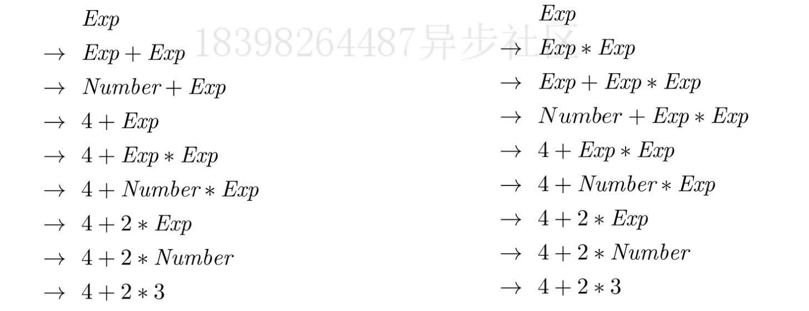
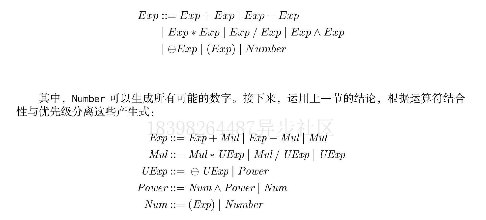
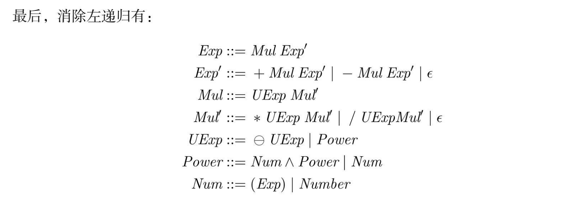

## 上下文无关文法 Context Free Grammer

上下文无关文法实际为一个四元元组，用 G 表示，G = (N,T,P,S)

**N 为非终结符号（non-terminal）的集合，元素一般为大写，T 为终结符号的集合，元素一般为小写，P 为生产式（production rule）。S为起始符号，S 一般是集合 N 中的元素**

若只考虑加法与乘法，则算术表达式的语法为
$$
Exp ::= Exp + Exp | Exp * Exp | (Exp) | Number
\\
Number ::= 所有可能的数字
$$
Exp 为起始符号，一个算术表达式的生成由它开始。Number 为非终结符，它可以生成所有的数字，数字为终结符号。+，* 为运算符也为终结符号，但是现在语法是有歧义的，可以由不同的生成步骤生成相同表达式。

若补充运算符的优先级和结合性，加法 与乘法的数学表达式的上下文无关文法应写成：

### 左递归消除

左递归无法通过惰性求值暂停表达式求值

将前面的算术表达式改为右递归语法，$\varepsilon$ 表示为空字符串

全数学运算符表达式解析

